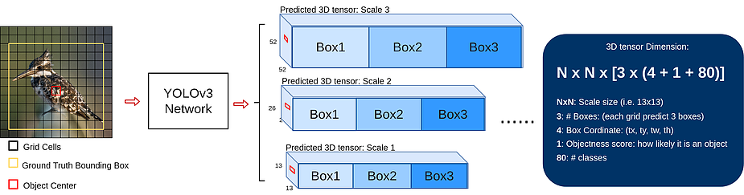
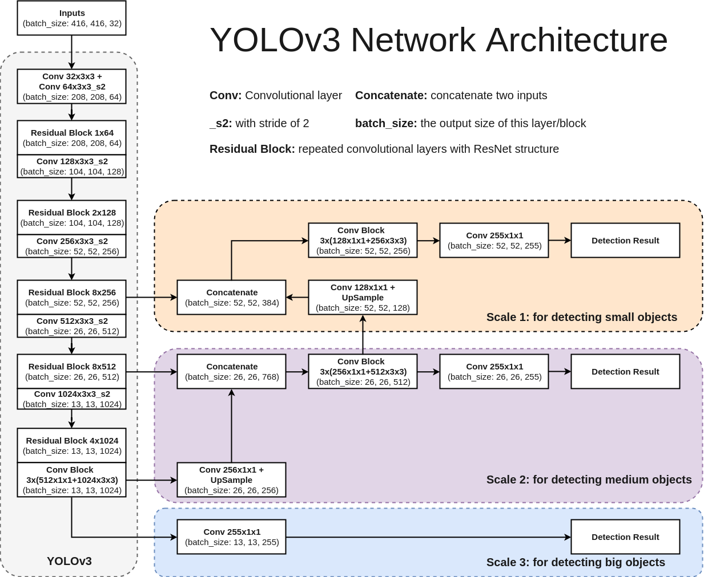
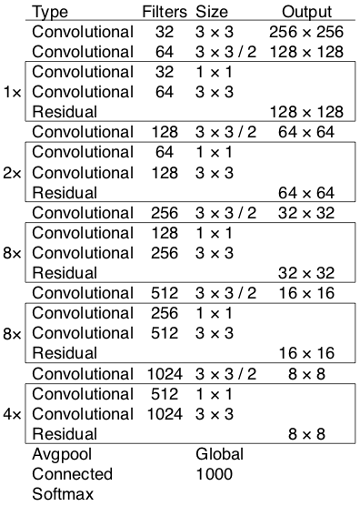

# Introducción

Dataset WIDERFACE [@yang2016wider].

# YOLOv3

## Descripción
YOLOv3 ("You only look once" versión 3) es una red neuronal con arquitectura **completamente convolucional** dirigida a detección de objetos, que destaca como uno de los algoritmos de detección más rápidos que hay; si bien es cierto que hay otros con mejor tasa de precisión, YOLO nos da la ventaja en su bajo tiempo de ejecución frente a los otros algoritmos, lo cual es esencial cuando necesitamos hacer reconocimiento de objetos en **tiempo real**.

## Funcionamiento general
YOLO realiza detección en 3 escalas distintas, de manera que devuelve un tensor3D para cada escala del mismo tamaño que la escala en la que está detectando, codificando la información de cada celda: las coordenadas de la caja, la puntuación de si es un objeto (querremos que sea 1 en el centro de la bounding box y 0 en caso contrario) y puntuación de cada clase. Además, en cada escala se predicen 3 cajas de tamaño prefijado, por lo tanto se tiene que devuelve un tensor3D de tamaño NxNx[3x(4+1+M)], con N el tamaño de la escala y M el nº de clases a detectar.

El entrenamiento se encarga de aprender la mejor caja (la que se superponga más sobre el ground truth) y de ajustar las coordenadas para la caja escogida; el tamaño de las cajas prefijadas se calcula usando un método de clustering K-medias al dataset antes de entrenar; este diseño permite que la red aprenda mejor y más rápido las coordenadas de las cajas prefijadas.

## Arquitectura
Como ya hemos comentado, YOLO usa una arquitectura completamente convolucional (permitiendo que podamos pasar cualquier tamaño de imagen), con 75 capas convolucionales en total.

El modelo está comprendido en dos partes:

- **Darknet-53**: es el extractor de características a distintas escalas, que se compone principalmente por 53 capas convolucionales, formada con bloques residuales (**ResNet**) que permite saltar conexiones, y con capas convolucionales con stride 2 que permiten hacer downsampling sin necesidad de usar pooling.

  Además después de cada convolucional se añade una capa BatchNormalization y con activación Leaky ReLU.

  

- **Detección en escalas**: como los objetos a detectar pueden aparecer de distintos tamaños y queremos detectarlos todos, tenemos un problema puesto que la red conforme es más profunda más le cuesta detectar objetos pequeños. YOLO resuelve esto usando una estructura de detección piramidal (Feature Pyuramid Network) que se encarga de detectar en 3 escalas distintas (pequeño, mediano y grande).

  

  Tomando el mapa de características que produce **Darknet** se pasa a la escala grande, y se hace upsampling x2 y luego la une con concatenación con otro mapa de características de nivel menos profundo para la escala mediana; repetimos con la escala pequeña.

## Predicción
Veamos los valores predichos para cada celda de la escala del output.

### Caja
Se predicen 4 coordenadas para cada bounding box, las coordenadas x e y del centro, y la anchura y altura de la caja, denotémoslas $t_x, t_y, t_w, t_h$. Ahora si la celda está desplazada de la esquina superior izquierda por un $(c_x, c_y)$, y siendo $p_w,p_h$ la anchura y altura de la caja prefijada, y $\sigma$ una función sigmoide, entonces las coordenadas de la caja predecidas son:

$\begin{gather*}
b_x = \sigma(t_x) + c_x \\
b_y = \sigma(t_y) + c_y \\
b_w = p_w e^{t_w} \\
b_h = p_h e^{t_h}
\end{gather*}$

Aunque en principio podría detectarse directamente las coordenadas, al entrenar ocasiona muchos gradientes inestables, por lo que se funciona mucho mejor prefijando una caja y aplicando transformaciones logarítmicas; en nuestro caso al tener 3 cajas fijadas obtendremos 4 coordenadas por cada caja. Para calcular las coordenadas se usa como función de perdida la suma de los errores cuadrados.

Realmente estas coordenadas no son absolutas, puesto que son relativas a la esquina superior izquierda de la imagen, y además se normalizan entre la dimensión de la celda del mapa de características; por tanto si las coordenadas del centro predichas son mayores que 1 producen que se salga del centro, de ahi que usemos la función sigmoide (deja entre 0 y 1).

### Objeto
Queremos otorgar una puntuación de manera que la celda del centro de la caja sea cercana a 1, mientras que por las esquinas sea cercano a 0. Este valor se predice mediante regresión logística.

### Clase
Cada caja predice la clase que puede tener el bounding box mediante clasificación multietiqueta, no usando softmax puesto que no influye en términos de rendimiento, pero de esta manera podemos etiquetar con varias etiquetas; así, se usa binary cross-entropy loss durante el entrenamiento.

## Detección
Cuando hacemos detección obtendremos muchas cajas, por lo que tendremos que filtrar. Primero ordenamos las cajas según su puntuación de objeto, ignoramos las que no sobrepasen un cierto umbral (por ejemplo 0.5) y finalmente aplicaremos supresión de no-máximos para muchas cajas superpuestas.

# Cosas por hacer

**Varios:**

- Entender todo el código. Eliminar lo que no sea necesario.
- Adaptar código para poder evaluar el conjunto de test (a partir de filelist, sin anotaciones).
- Ver por qué no coincide la métrica de evaluación de `evaluate_coco` con la de `codalab`. Reimplementar para que coincidan. Posiblemente cambiar el cálculo de AP a la interpolación en 101 pasos (https://kharshit.github.io/blog/2019/09/20/evaluation-metrics-for-object-detection-and-segmentation). Si no funciona, probar con 11 pasos.

**Entrenamiento:**

- Hacer finetuning a partir de los pesos de COCO iniciales (congelar unas cuantas capas, ¿cuáles?)
- Cambiar optimizador a SGD, RMSProp, Adabound(https://github.com/Luolc/AdaBound/blob/master/adabound/adabound.py) <---
- Entrenar más épocas. <---
- Entrenar con un valor mayor de *xywh_scale* en el config. Por ejemplo 2? <---
- Entrenar con un mayor tamaño de entrada de las imágenes. Ahora mismo en Colab no es viable.
- Aumentar el umbral *ignore_thresh*, por ejemplo a 0.6 ó 0.7.

**Evaluación:**

- Aumentar tamaño de entrada (no sé si tiene sentido que supere al input_size de entrenamiento) <---
- Aumentar umbral supresión de no máximos, por ejemplo a 0.6

**Opcionales:**

- Reimplementar la funcíón de supresión de no máximos en su versión vectorizada, para que sea más rápida. Adaptar implementación de https://www.pyimagesearch.com/2015/02/16/faster-non-maximum-suppression-python/

# Información a tener en cuenta

- The output of the model is, in fact, encoded candidate bounding boxes from three different grid sizes: 13x13, 26x26 y 52x52.

- Explicación de mAP: `https://medium.com/@jonathan_hui/map-mean-average-precision-for-object-detection-45c121a31173`

PASOS SEGUIDOS:

1. Convertir las anotaciones de WIDERFACE a formato VOC. Para ello se ha usado el archivo `convert.py`, adaptado de https://github.com/akofman/wider-face-pascal-voc-annotations/blob/master/convert.py
4. Generar anchor boxes para nuestro conjunto usando k-means con gen-anchors.py, y ponerlos en el config.
5. Descargar los pesos backend.h5 preentrenados en COCO.
6. Comenzar el entrenamiento en nuestro conjunto.
7. Validar usando el servidor de Codalab (https://competitions.codalab.org/competitions/2014).

*** Entrenamiento tras 130 épocas: ***

Parámetros: min-input: 288, max-input: 512

AP (Pascal VOC 2007): ~0.68
mAP (COCO 2017): 0.38

*** Finetuning ***

--> 288,512,ig06,xywh2

- 17 épocas (early stopping) congelando todo menos las 10 últimas capas. Lr inicial de 1e-3, batch size de 12 (train_hist_finetuning). Loss: 53.42
- 80 épocas. Todo descongelado. Batch size 8. Lr inicial 1e-4.

mAP: 0.39

--> 352,512,ig07

- 30 épocas congelando todo menos los 3 bloques de detección. Lr inicial de 1e-3. Bath_size de 12. Warmup epochs = 4. Loss:
- 50 épocas con todo descongelado. Lr inicial 1e-4. Batch size de 8. Loss:

Evaluación:

input_size=1024, obj_thresh = 0.6, nms_thresh = 0.45

mAP:
AP:

# Apéndice: Funcionamiento del código {.unnumbered}

<!-- Esto es una prueba de referencia al apéndice: [Apéndice A: Funcionamiento del código].-->

# Bibliografía {.unnumbered}
