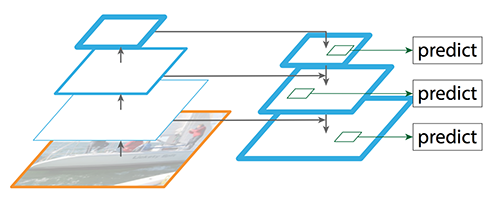

# Introducción

El objetivo de este proyecto es usar la red neuronal YOLOv3 preentrenada en la base de datos COCO para detectar caras sobre la base de datos WIDERFACE.

{width=350px}

Veremos los *datasets* usados, el funcionamiento y estructura general de YOLOv3, cómo la hemos usado y entrenado para detectar, resultados y las conclusiones.

# Conjuntos de datos

## COCO
Hemos obtenido los pesos de YOLOv3 después de ser entrenada en el dataset COCO [@coco]. Es un dataset con más de 200.000 imágenes con objetivos etiquetados, 91 clases, con 1.5 millones de objetos; en este dataset se encuentra la clase "persona".

Para la tarea de reconocer caras no es necesaria toda la información de distintos objetos que haya reconocido en COCO, pero como ha aprendido a reconocer personas de un dataset potente podemos aprovechar eso como base para nuestro detector, si bien es cierto que puede que cueste debido a que en algunas imágenes de personas en COCO no aparecen sus caras o están lejos (están centradas en personas).

## WIDERFACE
Vamos a usar el *dataset* WIDERFACE [@yang2016wider] para entrenar y evaluar la red, el *dataset* de entrenamiento contiene 12.921 imágenes con 393.703 caras con *bounding boxes* anotadas que incluye una gran variedad conforme a la forma de las caras: en número, escala, pose, expresión, con maquillaje, distinta iluminación...

Para la evaluación se proporciona un *dataset* de 16.151 imágenes de distribución similar al de entrenamiento pero con imágenes nuevas para comprobar el buen funcionamiento de la red. Sin embargo, no se liberan los valores de *ground truth* para este conjunto, y las competiciones asociadas y los servidores de evaluación están inactivos en este momento. Por lo tanto usamos el *conjunto de validación* para evaluar los resultados, que contiene 3.230 imágenes.

Hay disponible un código de evaluación en la [competición de Codalab](https://competitions.codalab.org/competitions/20146#learn_the_details) asociada a este *dataset*. Es por esto que los resultados de la evaluación estarán dados en el formato que acepta este servidor de evaluación (un archivo de texto plano con todas las detecciones de todas las imágenes).

# YOLOv3

## Descripción
YOLOv3 (*You only look once* versión 3) es una red neuronal con arquitectura **completamente convolucional** dirigida a detección de objetos, que destaca como uno de los algoritmos de detección más rápidos actualmente. Si bien es cierto que hay otros con mejor tasa de precisión, YOLO nos da la ventaja en su bajo tiempo de ejecución frente a los otros algoritmos, lo cual es esencial cuando necesitamos hacer reconocimiento de objetos en **tiempo real**.

Nos basaremos en el paper original [@yolov3] para describir el funcionamiento de esta red.

## Funcionamiento general
YOLO realiza detección en 3 escalas distintas, de manera que devuelve un tensor3D para cada escala del mismo tamaño que la escala en la que está detectando, codificando la información de cada celda: las coordenadas de la caja, la puntuación de si es un objeto (querremos que sea 1 en el centro de la bounding box y 0 en caso contrario) y puntuación de cada clase. Además, en cada escala se predicen 3 cajas a partir de la desviación que tengan con otras de tamaño prefijado (*anchor boxes*). En cada escala se devuelve como predicción un tensor3D de tamaño $N\times N \times [3 \times (4+1+M)]$, con N el tamaño de la escala y M el número de clases a detectar (en nuestro caso M=1).

{width=450px}

## Arquitectura
Como ya hemos comentado, YOLO usa una arquitectura completamente convolucional (permitiendo que podamos pasar cualquier tamaño de imagen).

{width=400px}

El modelo se divide en dos partes:

- **Darknet-53**: es el extractor de características a distintas escalas, que se compone principalmente por 53 capas convolucionales, que incluye bloques residuales (2 convoluciones + 1 skip), y con capas convolucionales con stride 2 antes de cada bloque para hacer downsampling sin necesidad de usar pooling. Además después de cada convolucional se añade una capa BatchNormalization y con activación Leaky ReLU.

  Vemos como se van incluyendo pequeños bloques con tamaño de filtros pequeño, y aumentamos ambos valores conforme profundizamos la red. Al final de cada bloque 8x se pasará una conexión a las escalas pequeña y mediana.

  {width=200px}

- **Detección en escalas**: como los objetos a detectar pueden aparecer de distintos tamaños y queremos detectarlos todos, tenemos un problema puesto que la red conforme es más profunda más le cuesta detectar objetos pequeños. YOLO resuelve esto usando una estructura de detección piramidal (Feature Pyramid Network) que se encarga de detectar en 3 escalas distintas (pequeña, mediana y grande), resultantes de dividir las dimensiones de la imagen de entrada entre 32, 16 y 8 respectivamente.

  {width=350px}

  Tomando el mapa de características que produce **Darknet** final se pasa a la escala grande directamente y a la mediana con upsampling 2x; en la grande se pasa al detector, y en la mediana se concatena con otro mapa de características (capa 61) menos profundo que se pasa a la escala mediana con upsampling 2x y a la mediana directamente al detector. Finalmente repetimos el proceso para la escala pequeña usando otro mapa de características (capa 36) menos profundo todavía concatenado con lo anterior que se pasa a un detector.

## Predicción
Veamos lo que produce en la capa de detección en cada escala, que consiste en una serie de valores (coordenas de la caja, puntuación de objeto, y puntuación de clase) por cada una de las 3 cajas prefijadas.

{width=300px}

### Caja
Se predicen 4 coordenadas para cada *bounding box*, las coordenadas $x$ e $y$ del centro, y la anchura y altura de la caja, denotémoslas $t_x, t_y, t_w, t_h$. Si la celda está desplazada de la esquina superior izquierda por un $(c_x, c_y)$, y siendo $p_w,p_h$ la anchura y altura de la caja prefijada, y $\sigma$ una función sigmoide, entonces las coordenadas de la caja predecidas son:
\begin{gather*}
b_x = \sigma(t_x) + c_x \\
b_y = \sigma(t_y) + c_y \\
b_w = p_w e^{t_w} \\
b_h = p_h e^{t_h}
\end{gather*}

{width=300px}

Para calcular las coordenadas se usa como función de pérdida la suma de los errores cuadrados.

Estas coordenadas se normalizan entre la dimensión de la celda del mapa de características; por tanto si las coordenadas del centro predichas son mayores que 1 producen que se salga del centro, de ahi que usemos la función sigmoide (deja entre 0 y 1). A la altura y anchura les pasa igual, y son normalizadas por el cociente anchura/altura de la imagen.

### Objeto
La puntuación de objeto consiste en cómo de probable es que un objeto esté dentro de la caja, por lo que idealmente queremos es que la celda del centro de la caja sea cercana a 1, mientras que por las las zonas exteriores cercanas a la caja sea casi 0.

### Clase
Cada caja predice la clase que puede tener el *bounding box* mediante clasificación logística multietiqueta, no usando *softmax* puesto que no influye en términos de rendimiento, y además de esta manera se permiten clases solapadas.

## Detección
Cuando hacemos detección obtendremos muchas cajas, por lo que tendremos que filtrarlas. Primero ordenamos las cajas según su puntuación de objeto, ignoramos las que no sobrepasen un cierto umbral y finalmente aplicamos supresión de no-máximos para condensar muchas cajas que estén superpuestas.

{width=400px}

# Métricas

Para evaluar los modelos usaremos la métrica __mAP__ (**mean Average Precision**). Para está metrica primero definimos las medidas de __precision__ y __recall__:

  - **Precision**: se mide el porcentaje de predicciones correctas, es decir, en las cajas predichas hay realmente un objeto de la clase.
    $$\text{Precisión} = \frac{\text{Verdaderos positivos}}{\text{Verdaderos positivos + Falsos positivos}}$$

  - **Recall**: se mide el pocentaje de casos positivos encontrados, es decir, la proporción de objetos detectados frente al total de objetos a detectar.
    $$\text{\textit{Recall}} = \frac{\text{Verdaderos positivos}}{\text{Verdaderos positivos + Verdaderos negativos}}$$

Para evaluar si un caja predicha es correcta, tomaremos la predicción y el *ground truth* y calculamos su __IoU__ (intersección sobre la unión), que consiste en calcular la proporción del área donde las dos cajas se intersecan frente al área de las dos cajas unidas. Diremos que la predicción es correcta si el valor __IoU__ vale más que un cierto umbral prefijado. En la Figura 9 observamos un ejemplo.

{width=300px}

Ahora representamos la curva $p(r)$ (*precisión-recall* o PR) de la siguiente manera: ordenamos las detecciones por la probabilidad de la clase, miramos si ha sido un verdadero positivo (acierto) o un falso positivo (detecta algo incorrecto), y procedemos a calcular la precisión y el *recall* actual, obteniendo un punto de la curva. Podemos ver en la siguiente Figura 10 siguiente un ejemplo con 10 detecciones.

{width=350px}

Como vemos el *recall* va en aumento, ya que puede quedarse igual o crecer (o no detectamos o detectamos más), mientras que la precisión va fluctuando según acertemos con las detecciones. Veamos ahora en la Figura 11 la curva PR que tendríamos.

{width=350px}

Entonces, definimos en este caso __AP__ (*Average precision*) como el area debajo de la curva PR, es decir:
$$AP = \int^1_0 p(r)dr,$$

que toma valores en el intervalo $[0, 1]$ por tomarlo también la precisión y el *recall*.

Sin embargo, para calcular la integral se toma la curva suavizando el *zigzag* que presenta, para evitar el impacto de las pequeñas variaciones; así, cambiamos el valor de la precisión de cada punto por la mayor precision que haya a la derecha del punto (es decir, la mayor precision alcanzada para *recall* mayor o igual que el actual):
$$p_{\text{inter}}(r) = \max_{r' \geq r} p(r').$$

En nuestro ejemplo quedaría algo así:

{width=350px}

Ahora tomamos una aproximación usando 11 valores de recall equiespaciados (también puede hacerse con 101) dados por $(0, 0,1, \dots, 1,0)$ y haciendo la media de la precisión en estos valores:

$$AP = \frac{1}{11} \sum_{r \in \{0, 0.1, \ldots, 1\}} p_{\text{inter}}(r_i)$$

Finalmente __mAP__ se toma como la media del __AP__ obtenido para cada clase.

En nuestro caso utilizaremos dos medidas, que son las más usuales en problemas de detección actualmente: `mAP@[.5:.95]` y `mAP@0.5`:

  - `mAP@[.5:.95]`: es la que se usa principalmente en COCO. Consiste en hacer la media de los __mAP__ obtenidos con un umbral distinto para calcular __IoU__, empezando en 0.5 hasta 0.95 en incrementos de 0.05.
  - `mAP@0.5`: usada originalmente PASCAL VOC (otro *dataset* conocido), es realizar __mAP__ calculando __IoU__ con el umbral a 0.5.

# Consideraciones previas al uso de la red

Como ya hemos comentado, utilizaremos la red YOLOv3 para realizar detección de caras en imágenes. En particular, emplearemos [esta implementación](https://github.com/experiencor/keras-yolo3) en Keras. Para tener un entorno de desarrollo adecuado se necesita hacer los siguiente.

1. En primer lugar, es necesario generar las *anchor boxes* para nuestro dataset. Ya dijimos que la red YOLOv3 predice *offsets* respecto a estos valores predeterminados, por lo que si queremos entrenar la red con imágenes de nuestro nuevo conjunto debemos proporcionar estas cajas prefijadas. Para ello, utilizamos el fichero `gen_anchors.py` que simplemente aplica el algoritmo de $k$-medias en el conjunto de entrenamiento para predecir el 3 *anchor boxes* en cada escala, dadas en función del alto y del ancho. El resultado es el siguiente:
$$[[2,4, 4,8, 7,14], [12,23, 20,36, 35,56], [56,95, 101,149, 177,234]]$$

2. Para trabajar con las anotaciones de *ground truth* es necesario convertirlas al formato VOC que maneja la implementación proporcionada. Para ello utilizamos el script `utils/convert_annot.py`, adaptado de [este código](https://github.com/akofman/wider-face-pascal-voc-annotations/blob/master/convert.py).

3. Por último, descargamos de [este enlace](https://drive.google.com/drive/folders/1pQNZ9snByUOMjvEf7Td8Zg1qvBAVhWZ8) los pesos preentrenados de la red en la base de datos COCO. Estos pesos se corresponden a todas las capas convolucionales, sin contar las capas de detección que dependen del *dataset* concreto que utilicemos.

4. Editamos el archivo `config.json` para establecer la ruta de las imágenes y de las anotaciones, y creamos un cuaderno en Google Colab para las ejecuciones. Este cuaderno puede consultarse en el archivo `yolo.ipynb`. Los detalles sobre el código que contiene se pueden consultar en el [Apéndice: Funcionamiento del código].

# Aspectos de entrenamiento de la red

Estudiamos a continuación las consideraciones más relevantes que hemos hecho a la hora de ajustar la red a nuestro conjunto de datos. Hemos decidido entrenar la red, pues al querer detectar una clase con la que no había sido entrenada anteriormente (en COCO no existe la clase "cara") pensamos que necesitaría ser entrenada de forma profunda en el nuevo conjunto.

Enumeramos los principales parámetros y técnicas que contemplamos.

## Data augmentation

La primera mejora que consideramos es realizar aumento de imágenes para obtener una mayor precisión en el conjunto de validación. Mediante la configuración de los parámetros `min_input_size` y `max_input_size` podemos establecer los tamaños mínimo y máximo de las imágenes, que deberán ser siempre múltiplos de 32. Por limitaciones en el entorno utilizado rara vez podremos superar tamaños de $512\times 512$ para entrenar.

A la hora de entrenar, las imágenes se redimensionan automáticamente cada 10 *batches* a algún tamaño comprendido entre el mínimo y el máximo que sea múltiplo de 32.

También aplicamos transformaciones aleatorias de escala y recorte, cuya intensidad se controla mediante el parámetro `jitter` para el generador de imágenes de entrenamiento. Por defecto la fijamos a 0.3.

## Tamaño del batch

Debido a las limitaciones en cuanto a la memoria disponible, nos vemos obligados a utilizar un *batch size* de 8 para las imágenes de entrenamiento. Congelando un número elevado de capas podemos llegar a un *batch size* de 12.

## Optimizador y learning rate

Empleamos el optimizador Adam para compilar el modelo. Comenzamos a entrenar los modelos con un *learning rate* elevado de 0.001, que es el valor por defecto de este optimizador. Disponemos de un *callback* de `ReduceLROnPlateau`, que establece un *learning rate* 10 veces menor cada vez que llevemos dos épocas sin mejorar la función de pérdida. De esta forma conseguimos acelerar la convergencia en las épocas iniciales y ajustar gradualmente los pesos conforme avanzamos en el entrenamiento.

## Épocas de "calentamiento"

El parámetro `warmup_epochs` del archivo de configuración permite especificar un número de épocas iniciales en las cuales las cajas predichas por el modelo deben coincidir en tamaño con los *anchors* especificados. Lo fijamos a 3, y notamos que solo se aplica en las primeras etapas del entrenamiento.

## Umbral de predicción

Internamente la red utiliza el parámetro `ignore_thresh` del archivo de configuración para decidir qué hacer con una predicción. Si el solapamiento entre la caja predicha y el valor de *ground truth* es mayor que el umbral, dicha predicción no contribuye al error. En otro caso, sí contribuye.

Si este umbral es demasiado alto, casi todas las predicciones participarán en el cálculo del error, lo que puede causar *overfitting*. Por el contrario, si este valor es demasiado bajo perderemos demasiadas contribuciones al error y podríamos causar *underfitting*. El valor por defecto es 0.5.

## Cálculo de la función de error

Mediante los parámetros `obj_scale`, `noobj_scale`, `xywh_scale` y `class_scale` podemos fijar la escala en la que afecta cada parte al error total. El primero se refiere al error dado al predecir que algo es un objeto cuando en realidad no lo era, y el segundo a la acción contraria. El tercero controla el error en la predicción de las cajas frente a los valores reales, y el cuarto el error en la predicción de clase. Los valores por defecto son 5, 1, 1 y 1, respectivamente.

## Otros callbacks

Disponemos de un callback de `ModelCheckpoint` que va guardando un modelo con los mejores pesos obtenidos hasta el momento, de forma que podemos reanudar el entrenamiento por donde nos quedásemos. También tenemos un callback de `EarlyStopping` para detener el entrenamiento si no disminuye el error en 7 épocas.

# Modelos entrenados y evaluación

Los parámetros utilizados para todas las evaluaciones son `obj_thresh = 0.5` y `nms_thresh = 0.4`. El primer parámetro se refiere al umbral a partir del cual se considera que un objeto detectado es realmente un objeto (el resto se descartan), y el segundo controla el umbral de la supresión de no máximos realizada para eliminar detecciones solapadas.

Mostramos ahora los modelos finales que hemos obtenido. Hemos hecho más pruebas de las que se reflejan aquí, pero la mayoría han sido infructuosas. En el directorio `logs` se guardan los historiales de entrenamiento para consultar gráficas con la herramienta `Tensorboard`.

## Modelo base

En primer lugar generamos un modelo base con el que compararemos nuestros intentos de mejora. Se trata simplemente de un modelo con los pesos preentrenados de COCO y una capa de detección añadida en cada escala. Lo entrenamos durante 10 épocas, congelando todas las capas excepto las 3 añadidas. Utilizamos los parámetros por defecto y no realizamos *data augmentation*, y elegimos un tamaño de entrada de $416 \times 416$.

Al evaluar este modelo obtenemos lo que ya esperábamos: unos resultados mediocres. Esto es normal, ya que la red no estaba entrenada originalmente para reconocer caras. Las métricas de evaluación obtenidas son:
```
mAP@.5:.05:.95: 0.0241
AP@0.5: 0.0818
```

## Modelo 1: entrenamiento completo

La primera prueba que hicimos fue entrenar el modelo completo partiendo de los pesos de COCO, de nuevo utilizando los parámetros por defecto. Esta vez sí empleamos aumento de datos, estableciendo los límites de las dimensiones en 288 y 512. Este modelo fue entrenado durante unas 130 épocas, a razón de unos 700 segundos por época. La pérdida fue disminuyendo hasta estancarse en un valor cercano a 19. Intentamos reiniciar el entrenamiento partiendo de un *learning rate* más elevado para escapar del óptimo local, pero este enfoque no surtió efecto.

La evaluación para un tamaño de entrada de $416 \times 416$ fue:
```
mAP@.5:.05:.95: 0.2043
AP@0.5: 0.4675
```

Vemos que mejora bastante al modelo base. Si evaluamos este mismo modelo con un tamaño de entrada de $1024 \times 1024$ obtenemos una precisión bastante mayor. A cambio debemos esperar bastante más tiempo a que se realicen las detecciones en las imágenes.
```
mAP@.5:.05:.95: 0.3760
AP@0.5: 0.6656
```

## Modelo 2: finetuning en los bloques de detección

Intentamos ahora realizar *finetuning* en los bloques de detección de imágenes. Fijamos el valor de `ignore_thresh = 0.7` y aumentamos al doble la contribución al error de las diferencias entre las cajas predichas y las verdaderas, haciendo `xywh_scale = 2`. Hacemos todo esto para intentar mejorar la precisión. Ahora cargamos los pesos de COCO y dividimos el entrenamiento en dos partes:

1. Congelamos toda la red excepto las 4 últimas capas de cada escala. Además, establecemos el *batch_size* a 12 y permitimos que las dimensiones de entrada fluctúen entre 416 y 672 (podemos aumentar el límite superior porque hemos congelado la mayoría de las capas). Entrenamos el modelo durante 30 épocas y nos estancamos en una pérdida alrededor de 36. El tiempo estimado por época es de 650s.

2. Ahora descongelamos todas las capas y entrenamos el modelo durante unas 70 épocas. Volvemos a establecer los límites de entrada en 416 y 512 y el *batch size* a 8, y esta vez partimos de un *learning rate* inicial de $10^{-4}$. Obtenemos una pérdida de 24.

Podemos ver la evolución de la función de pérdida durante la primera etapa de *finetuning*:

{width=400px}

El resultado de la evaluación del modelo con tamaño de entrada $1024\times 1024$ es el siguiente:
```
mAP@.5:.05:.95: 0.4053
AP@0.5: 0.7255
```

Vemos que supera al modelo anterior en ambas métricas, por lo que los ajustes realizados han surtido efecto.

## Modelo 3: congelar extractor de características

El último intento exitoso de mejora del modelo es parecido al anterior, pero esta vez congelamos únicamente el extractor de características de la red: las 74 primeras capas. Los parámetros fijados son los mismos.

1. En la primera etapa entrenamos 25 épocas partiendo de un *learning rate* de 0.001 y obteniendo una pérdida de 30. El tiempo estimado por época es de 730s.

2. A continuación entrenamos el modelo completo durante 50 épocas, llegando a una pérdida de 25.

Al evaluar con tamaño de entrada $1024\times 1024$ obtenemos los siguientes resultados:
```
mAP@.5:.05:.95: 0.3923
AP@0.5: 0.7082
```

Vemos que se obtiene un resultado muy similar al del modelo anterior, pero un poco por debajo. Sin embargo, este modelo ha sido entrenado durante unas 30 épocas menos. En general, al emplear la técnica de *finetuning* conseguimos reducir el número de épocas y conseguir un resultado igual de bueno o incluso mejor que el obtenido al entrenar el modelo completo muchas épocas.

# Ejemplos de detección

Ponemos algún ejemplo de caras detectadas con nuestro modelo. Lo que hemos observado es que consigue detectar caras muy bien cuando están bien separadas, e incluso las caras pequeñas o de perfil consigue detectarlas. Cuando hay muchas caras juntas y superpuestas (por ejemplo un grupo de personas en una foto tomada de lejos) a veces no detecta correctamente todas las caras. Sin embargo, en muchas fotos consigue detectar la mayoría con gran precisión.

También hemos realizado una prueba de detección en vídeo que se adjunta entre los archivos entregados con el nombre de `video_detect.mp4`. Lo que hacemos es leer el vídeo con *OpenCV* para obtener las imágenes frame a frame, aplicarles nuestro detector y después volver a construir el vídeo con los mismos FPS.

En verde mostramos la caja predicha por la red y en rojo el valor real de *ground truth*. También mostramos un ejemplo con caras más pequeñas.

{width=350px}

{width=350px}

# Conclusiones

Hemos conseguido adapatar la red YOLOv3 preentranada en COCO sin conocimiento previo de los objetos de tipo "cara" para detectar correctamente estos. La precisión conseguida es bastante buena, siendo mejor la métrica `AP@0.5`. Esto no es de extrañar, pues en el propio *paper* de YOLOv3 los autores comentan que el desempeño de la red en la nueva métrica de COCO no es demasiado elevado.

Podríamos haber hecho más pruebas de entrenamiento, por ejemplo cambiando el optimizador a SGD ó RMSprop. También comentamos que hemos entrenado los modelos un número quizás demasiado elevado de épocas, pues en algunas ocasiones con menos épocas el resultado seguía siendo el mismo.

En general, aunque el rendimiento de esta red es bueno, existen otras redes como Faster R-CNN o RetinaNet que podrían proporcionar mejores resultados en esta tarea de detección.

# Apéndice: Funcionamiento del código {.unnumbered}

## Construcción del modelo

En el archivo `yolo.py` se encuentra la función `create_yolov3_model` para crear un modelo completo, utilizando la función auxiliar `_conv_block` para ir creando los bloques convolucionales. Hemos realizado algunas modificaciones que nos permitan congelar las capas del extractor de características si queremos.

Además, en el archivo `voc.py` se encuentra la función `parse_voc_annotation` que nos permite leer las anotaciones de un fichero y crear las variables necesarias para describir adecuadamente cada imagen.

## Generadores de imágenes

En el archivo `generator.py` se encuentran funciones para manejar un generador personalizado de imágenes. Es aquí donde se realiza el aumento de datos y se controla cómo se van generando imágenes en cada pase por la red.

## Entrenamiento

El archivo `train.py` junto con la función `_train` del *notebook* controlan el entrenamiento del modelo. Se comienza leyendo las anotaciones para obtener el conjunto de imágenes de entrenamiento anotadas. Después se crea un generador de imágenes con los parámetros adecuados, y a continuación se general el modelo con `create_model`. Esta función se encarga de cargar los pesos preentrenados si existen y de compilar el modelo. Después se añaden los *callbacks* deseados mediante `create_callbacks` y finalmente usamos `fit_generator` para comenzar el entrenamiento.

## Evaluación

Para la métrica `AP@0.5` se dispone de código que realiza la evaluación. Hemos modificado el código para permitir simplemente crear un archivo con las cajas detectadas en todas las imágenes en el formato de la competición de Codalab, para poder comprobar la otra métrica. Esto se realiza mediante la función `pred_boxes`.

Para la evaluación de la métrica está implementado el algoritmo descrito en la Sección [Métricas], con el nombre de `evaluate_pascal`. La evaluación completa se realiza mediante la función `_evaluate` del cuaderno.

## Detección

Se proporcionan las funciones `_detect_one` y `_detect_video` en el cuaderno para realizar detecciones en imágenes. La primera recibe como parámetro o bien la anotación de una imagen o bien la ruta de la misma. Después de leer correctamente la imagen y las anotaciones (si las hubiera), llama a la función `get_yolo_boxes`. Esta se encarga de realizar la predicción completa de cajas en la imagen: pasa la imagen por la red, decodifica el resultado mediante `decode_netout`, corrige las cajas para que se puedan representar en las dimensiones de la imagen de entrada con `correct_yolo_boxes`, y realiza supresión de no máximos con `do_nms`.

Una vez detectadas las cajas, las dibujamos sobre las imágenes con la función `draw_boxes`.

El procedimiento para detección en vídeo sigue la misma idea, pero se sirve de las clases `VideoCapture` y `VideoWriter` de *OpenCV* para extraer los frames del vídeo y poder realizar detecciones en ellos.

# Bibliografía {.unnumbered}
